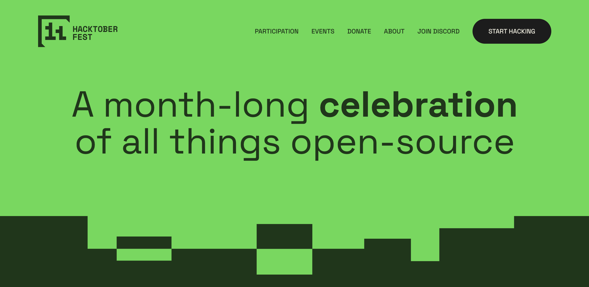

# design2code2live


Welcome all developers to design2code2live.

Can you code? If i provide you a design.

Build the code from the design and push it to the repository. You can see your design live from 
`https://aravindkumarv.xyz/design2code2live/{DesignName}`

github link: https://github.com/lmas3009/design2code2live

## Contribute through Hacktoberfest 2024
HACKTOBERFEST IS FOR EVERYONE. WHETHER IT’S YOUR FIRST TIME—OR YOUR NINTH—IT’S ALMOST TIME TO HACK OUT FOUR PRISTINE PULL/MERGE REQUESTS AND COMPLETE YOUR MISSION FOR OPEN SOURCE  

Link 👉https://hacktoberfest.com/


JOIN THE DISCORD - https://discord.com/invite/RfMEVfVGJk and get notified when the event starts and information related to designs.


## This year are giving away sticker packs for all the developers who contributes to design2code2live


## Contribution Guidelines

1. Select the respective issue

2. Get assigned to the issue

3. Fork the repository

4. Create a new branch
```
git checkout -b {branchName}
```

5. Create a new folder

6. Add your source code and design image

7. Commit your code
```
git commit -m {Design Name}
```

8. Push your code
```
git push -u origin {BranchName}
```

9. Create a PR (Pull Request)

10. Wait until the PR is accepted and merged with `hacktoberfest-accepted` tag

If you like to contribute to this project. Please make sure you star it.


